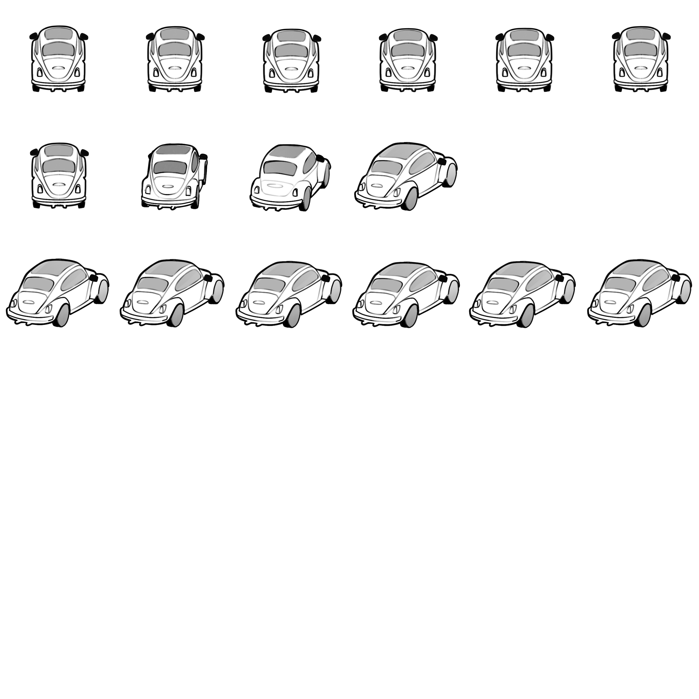

# Chris's Crisis

A 2D arcade-style tube shooter game inspired by the classic Gyruss, reimagined with a unique automotive nightmare theme. Navigate through a dream-like tunnel world where trees have turned hostile and the road becomes your battleground.



## 🎮 Game Overview

Chris's Crisis transforms the classic tube shooter formula into a surreal automotive nightmare. Players control a car moving in a circular pattern around a central vanishing point, shooting at various tree enemies that emerge from the tunnel depths. The game features multiple levels, boss battles, power-ups, and bonus rounds, all wrapped in a dream-like aesthetic.

### 🌟 Key Features

- **360° Circular Movement**: Navigate around the tunnel perimeter with smooth rotational controls
- **Dynamic Enemy System**: Face various tree types (oak, palm, spruce) with unique behaviors and attack patterns  
- **Boss Battles**: Encounter massive tree bosses that spawn minions and present unique challenges
- **Power-Up System**: Collect upgrades to enhance your firepower and abilities
- **Wave-Based Progression**: Complete 3 levels per "night" (stage) with bonus rounds
- **Immersive Audio**: Custom soundtrack and sound effects enhance the nightmare atmosphere
- **Level of Detail System**: Dynamic sprite scaling based on distance for enhanced 3D tunnel effect

## 🎯 Gameplay Mechanics

### Core Gameplay Loop
1. **Movement**: Rotate clockwise/counterclockwise around the tunnel perimeter
2. **Combat**: Shoot projectiles toward the center to eliminate enemies
3. **Survival**: Avoid enemy projectiles and collision damage
4. **Progression**: Clear waves to advance through levels and unlock bonus rounds

### Enemy Types
- **Basic Trees**: Standard enemies with simple movement patterns
- **Projectile Trees**: Launch branches, acorns, and other natural projectiles
- **Boss Trees**: Large enemies that spawn smaller trees and have multiple attack phases
- **Minion Trees**: Smaller, faster enemies spawned by bosses

### Power-Ups
- **Enhanced Firepower**: Increased bullet damage and fire rate
- **Speed Boost**: Faster movement around the tunnel
- **Multi-Shot**: Fire multiple projectiles simultaneously

## 🎮 Controls

| Input | Action |
|-------|--------|
| **A** / **Left Arrow** | Rotate clockwise |
| **D** / **Right Arrow** | Rotate counter-clockwise |
| **Space** | Fire bullets toward center |

## 🛠️ Technical Details

### Built With
- **Unity 6000.0.51f1** - Game engine
- **C#** - Programming language
- **Unity Input System** - Modern input handling
- **Universal Render Pipeline (URP)** - Enhanced graphics rendering
- **Audio Mixer** - Professional audio management

### Project Structure
```
Assets/
├── Scripts/           # Game logic and controllers
│   ├── Game/         # Core gameplay systems
│   ├── Utilities/    # Helper scripts and tools
│   └── Interfaces/   # Abstract interfaces
├── Sprites/          # 2D artwork and animations
├── Sounds/           # Audio files and music
├── Scenes/           # Game levels and menus
├── Prefabs/          # Reusable game objects
├── Animations/       # Animation controllers
└── Materials/        # Rendering materials
```

### Key Systems
- **Polar Coordinate System**: Custom transformation system for circular movement
- **Wave Management**: Dynamic enemy spawning and level progression
- **Audio Management**: Centralized sound effect and music control
- **Health System**: Player lives and enemy health tracking
- **Pickup System**: Power-up collection and effects

## 🚀 Installation & Setup

### Prerequisites
- Unity 6000.0.51f1 or later
- Windows, macOS, or Linux
- Minimum 4GB RAM
- DirectX 11 compatible graphics card

### Running the Game
1. Clone this repository:
   ```bash
   git clone https://github.com/username/Chris-s-Crisis.git
   ```
2. Open the project in Unity Hub
3. Load the `StartScene` or `0_title` scene
4. Press Play in the Unity Editor

### Building the Game
1. Open **File > Build Settings**
2. Select your target platform
3. Click **Build** and choose output directory
4. Run the generated executable

## 🎨 Art & Audio

### Visual Style
- **Non-pixel art 2D graphics** with hand-drawn sprites
- **Dynamic scaling system** creates depth perception in the tunnel
- **Particle effects** for shooting and impact feedback
- **Animated sprites** for cars, trees, and projectiles

### Audio Design
- **Custom soundtrack** designed for each level
- **Spatial audio effects** for movement and combat
- **Dynamic music system** that responds to gameplay events
- **Environmental audio** enhances the tunnel atmosphere

## 🏆 Game Progression

### Level Structure
- **3 Levels per Night**: Each "night" represents a complete stage
- **Bonus Rounds**: Special levels with unique mechanics and rewards
- **Progressive Difficulty**: Enemies become faster and more numerous
- **Score System**: Points awarded for enemy elimination and survival time

### Feedback Integration
Based on interim presentation feedback, the following improvements were implemented:
- Enhanced background curvature for better tunnel immersion
- Increased projectile visibility and contrast
- Improved color differentiation for better accessibility
- Added enemy approach indicators
- Refined audio mixing and background music selection

## 🤝 Contributing

This project was developed as part of a game development course. While not actively seeking contributions, feedback and suggestions are welcome through issues.

## 📝 License

This project is for educational purposes. All assets and code are proprietary to the development team.

## 🎯 Credits

**Development Team**: Game Programming Course Students  
**Inspiration**: Original Gyruss arcade game  
**Engine**: Unity Technologies  
**Special Thanks**: Course instructors and playtesters who provided valuable feedback

---

*Experience the nightmare. Survive the crisis. Master the tunnel.*
